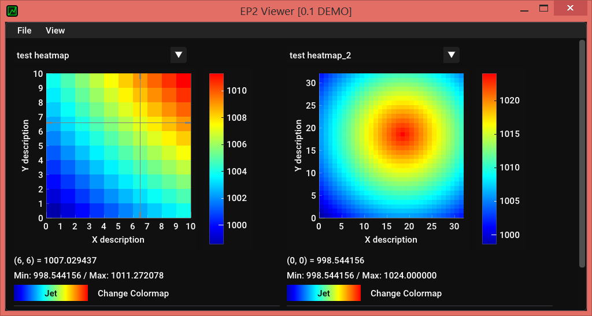

# easy_plot_v2

Библиотека для рисования и отображения графиков

- *На данный момент поддерживаются только тепловые карты!*

## Особенности

Каждый график сначала сохраняется в файл. Один файл может содержать любое количество графиков. Каждый график можно отдельно настроить.
Далее, сохраненный файл можно просмотреть при помощи программы *easy_plot_v2\bin\ep2-viewer.exe*.


## C++ часть

* Для работы нужна библиотека (json)[https://github.com/nlohmann/json]
* Библиотека использует только *header* файлы
* Рисование графиков происходит в отдельной программе


```cpp
#include "easy_plot_v2/ep2.hpp"

//...


ep2::PlotConfig config;
config.file_name = "test.ep2";
config.name = "test";
config.note = "Your description could be here";

ep2::PlotConfig::Heatmap heatmap;
heatmap.init(10,10);
for(size_t x = 0 ; x < heatmap.w; ++x) {
	for(size_t y = 0; y < heatmap.h; ++y) {
		heatmap.data[x][y] = 1024 - std::sqrt((x - 18) * (x - 18) + (y - 18) * (y - 18));
	}
}
heatmap.name = "test heatmap";
heatmap.note = "Your description could be here";
heatmap.text_x = "X description";
heatmap.text_y = "Y description";

config.add_heatmap(heatmap);

if (!ep2::save_plot(config)) {
	std::cout << "Error: ep2::save_plot" << std::endl;
}

// Отличается от save_plot вызовом программы для просмотра графика
if (!ep2::draw_plot(config)) {
	std::cout << "Error: ep2::draw_plot" << std::endl;
}

```

## Программа для просмотра файлов



Для корреткной работы программы, необходимо прописать путь к папке с программой.
